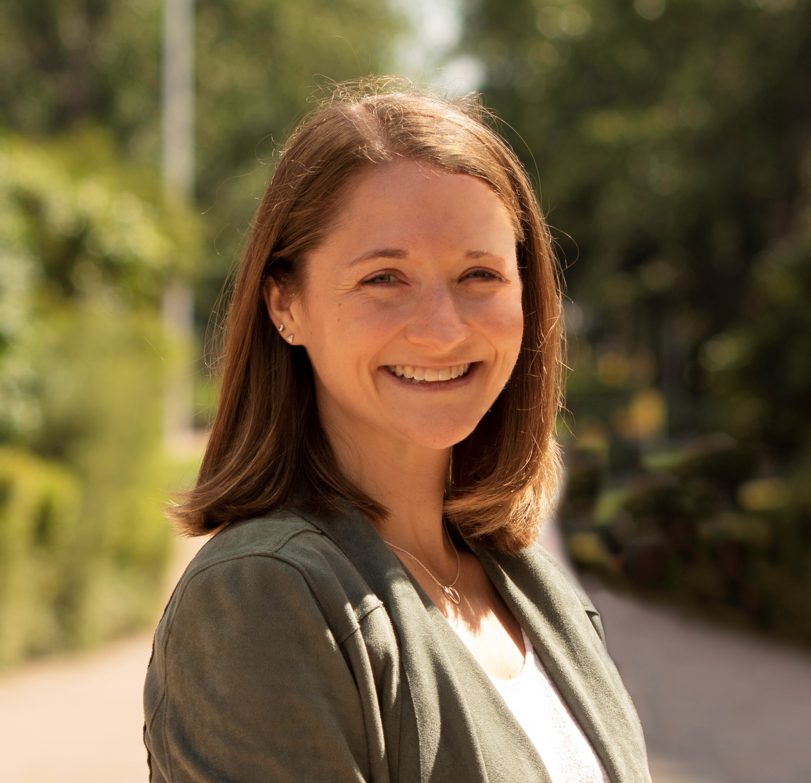
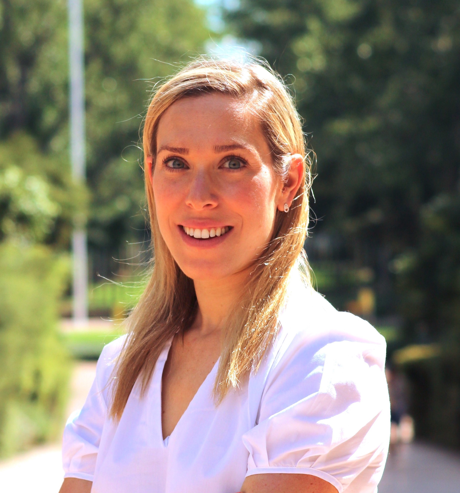

```{r, include=FALSE, warning=FALSE, message=FALSE}
library(tidyverse)
```


# About NEWScribo

Over the next several weeks, we will introduce you to "R". R is a free, open source programming language that is often used for statistical and data analyses and visualizations. Don't worry if you have no prior experience with coding or if you've never heard of R - we'll cover everything from the basics to creating beautiful graphs! Below you can check out our tentative schedule and brief bios of Jenny and Tehilla (your PhD mentors):

# Schedule - coded in R!
```{r}
Workshop <- c(1:5)

Date <- c("November 1st", 
          "November 15th", 
          "November 22nd", 
          "November 29th", 
          "Week of December 6th")

Topic <- c("Intro to Programming and R", 
           "Data Manipulation and Wrangling", 
           "QnA Session", 
           "Data Visualisation", 
           "Showcase!!")

schedule <- data.frame(Workshop, Date, Topic)

schedule %>%
  gt::gt()

```


# About us

<!-- <div style = "margin-left: 0px; margin-right: 0px; float:left;"> -->
<!-- {width=25%} -->
<!-- </div> -->

<!--  -->

<!-- <div style = "margin-left: 200px; margin-right: 80px;"> -->

:::float-image

```{r out.width='175px', out.extra='style="float:left; padding:10px"', echo=FALSE}

```

<p> Jenny is a PhD student studying cognitive science at UNSW, Sydney. She received her Bachelors in psychology from the University of Maryland and her Masters of Science in experimental psychology from Syracuse University. Her research interests include studying the effects of interruptions and time-pressure on decision-making; read more [here](https://blogs.unsw.edu.au/mathssciencechampions/blog/2019/05/the-life-of-a-mathematical-psychologist-jenny-sloane/). Jenny is a committe member of the UNSW codeRs. In her spare time, Jenny enjoys running and watching sports (particularly NFL... go Ravens!). </p>

:::
:::float-image

```{r out.width='175px', out.extra='style="float:right; padding:10px"', echo=FALSE}

```

<p> Tehilla is a PhD student studying cognitive science at UNSW, Sydney. She received her Bachelor and Masters of Science degrees from the University of Basel, Switzerland. Her research focuses on the interaction between risky decision-making and information-seeking behaviour; read more [here](https://blogs.unsw.edu.au/mathssciencechampions/blog/2021/04/disentangling-decision-making-meet-tehilla/). Tehilla is a committee member of the UNSW R-codeRs and is a member of the Women in Math & Science Champion Program. Away from work, Tehilla practices kickboxing, takes long morning walks, and enjoys reading about the Philosophy of Science. </p>

:::

<br>
*We built this website completely in R using the `distill` package* 


