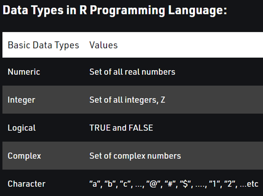

In this workshop, we learned about the syntax of R, including several common operators, vectors, and different types of variables. We also briefly introduced Tidyverse and discussed packages and how to install and load (or call) in the libraries for the packages you want to use.

Before we get started, here are the instructions if you want to change your R Markdown preferences to print your code in the console as opposed to directly below the R chunk: <br>
*Tools -> Global Options -> R Markdown -> uncheck where is says "show output inline for all..."*

```{r setup, include=FALSE}
knitr::opts_chunk$set(echo = TRUE, warning=FALSE, message=FALSE)
```

# Syntax 

Syntax in computer programming is a set of rules that defines the structure of a language, similar to how we have rules for grammar and spelling. If you write a sentence with incorrect spelling or grammar, the sentence may not make sense. If you write code without proper syntax, the code won't be able to run and you'll get an error message. 

## Operators
```{r}
x <- 10 # assignment operator
y <- 25
z <- 100

x > y # greater than operator: 10 > 25?
x < y  # less than operator

# x = y
x == y # equality operator
x != y # not equal to operator 

z > 50 & z < 200 # & is the "and" operator
z > 50 & z > 200

z > 50 | z > 200 # | is the "or" operator
```

## Vectors

- In R, a vector is the simplest type of data structure. It is "a single entity consisting of a collection of things"

```{r}
names <- c("Kevin", "Jenny", "Millie")

age <- c(20, 18, 33)

blue_eyes <- c(TRUE, FALSE, FALSE)
```

## Types of Variables



```{r}
typeof(names)
typeof(age)
typeof(blue_eyes)
```

# Tidyverse

- Tidyverse is a package, well it's actually a collection of 8 packages (ggplot2, dplyr, tidyr, readr, purrr, tibble, stringr, forcats) introduced by Hadley Wickham to help with data manipulation, exploration, and visualisation
  - You can check out the tidyverse <https://www.tidyverse.org/packages/> to find out more details of each of the individual packages
  
# Packages

- Remember, a package is a collections of code, data, and documentation all bundled together in a standardized way that can be easily shared and installed by other R users

- **Installing packages**: when you want to use a package for the first time, you must install the package with `install.packages("package_name")` - note the package name must be in quotes. You only need to install a package 1 time on your local computer, so I suggest using the console to install packages
- **Loading packages/libraries**: every time you start a new session, you have to tell R what packages you want to load in. You do this with the `library(package_name)` - note the package name does not need to be in quotes here

- Whenever you load tidyverse, you will see a message saying it’s attaching all 8 packages. Therefore, you don’t have to load in any of the individual packages because they all get called in together. This means as long as you load in tidyverse, you can use functions from any one of the 8 packages

We will use the `tidyverse` and `palmerpenguins` packages

```{r}
# install.packages("tidyverse") # run in console
# install.packages("palmerpenguins")

library(tidyverse)
library(palmerpenguins)
penguins
```
